= Envidia
:author: Manuel L. Quero
:toc: left
:doctype: book

== Despliegue de la máquina

Sería conveniente utilizar una distribución Linux, es recomendable usar Kali Linux.

Como requisito, necesitaremos tener instalado docker y docker-compose.

Podemos ver como instalar docker para varias distribuciones de linux -> https://docs.docker.com/engine/install/[Instalar Docker]

Podemos ver como instalar docker-compose para varias distribuciones de linux -> https://docs.docker.com/compose/install/linux/[Instalar Docker-Compose]

Necesitaremos descargar primeramente el auto_deploy.sh, el cual se muestra como una pirámide en la página. Después deberemos meter en un directorio tanto el auto_deploy.sh como el archivo de envidia.tar, y ejecutar los siguientes comandos.

(Si el auto_deploy no tiene permisos se los damos mediante *chmod +x*). 

[source,bash]
----
$ sudo bash auto_deploy.sh envidia.tar
----

== Escalada de privilegios

La escalada de privilegios es el uso de una falla de software, una vulnerabilidad, un defecto de diseño, una falla de configuración o un control de acceso en un sistema operativo o aplicación para obtener acceso no autorizado a recursos que normalmente están restringidos para una aplicación o usuario.

Como resultado, la aplicación o el usuario obtienen más privilegios de los que fueron diseñados por el desarrollador o administrador del sistema, lo que permite a los atacantes acceder a información confidencial, instalar malware y lanzar otros ciberataques.

=== Tipos de escalada

. *Escalada de privilegios vertical* -> El atacante comienza con una cuenta de bajo nivel (por ejemplo, un usuario estándar) y busca elevar sus privilegios para obtener acceso administrativo (como root en Linux o administrador en Windows). El objetivos comunes es acceder a datos sensibles, instalar malware, ejecutar comandos como administrador.

. *Escalada de privilegios horizontal* -> El atacante ya posee una cuenta privilegiada, pero intenta acceder a recursos o funciones que están fuera del alcance original de ese usuario. En aplicaciones web implica acceder a cuentas de otros usuarios, como acceder al panel de administrador desde una cuenta normal.

=== Vectores de ataque

Nosostros nos vamos a centrar en la escalada de privilegios vertical.

==== 1. Archivo sudoers

El archivo Sudoers es el archivo en el que se almacenan los usuarios y grupos que tienen privilegios root para ejecutar algunas o todas las órdenes como root o otro usuario, este archivo se encuentra en /etc. La sintaxis es la siguiente para el permiso root por defecto *"root ALL = (ALL: ALL) ALL"*, aunque también hay una opción TAG disponible que es opcional.

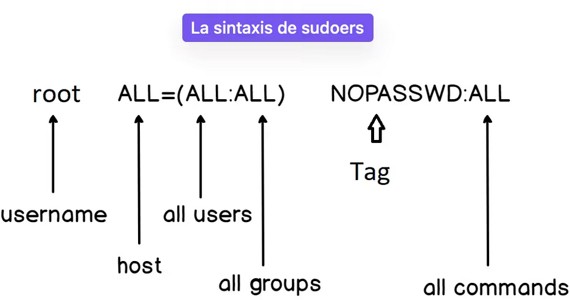

Por lo que en este archivo se puede dar privilegios root a los comandos binarios, poniendo en la configuración el binario en concreto *"NOPASSWD : /usr/bin/find"* este tipo de autorización lleva a una elevación de privilegios para acceder a root, además la etiqueta NOPASSWD significa que no se pedirá ninguna contraseña para la autenticación al ejecutar el comando sudo -l.

==== 2. Binario SUID

El bit SUID (Set User ID) se utiliza en archivos ejecutables para otorgar al usuario que los ejecute los privilegios del propietario del archivo (generalmente root). Esto es necesario en algunos binarios, como /usr/bin/passwd, para realizar acciones que requieren permisos elevados.

Sin embargo, si el binario con el bit SUID activado es vulnerable, un atacante puede explotarlo para ejecutar comandos como root. Este tipo de vulnerabilidad puede ser detectado fácilmente usando herramientas como find para localizar archivos con el bit SUID activado.

==== 3. Cron ejecutando script editable

Primeramente debemos entender crontab, hay dos tipos:

* *Crontab del sistema* -> Se encuentra en */etc/crontab*, principalmente sirve para programar tareas a nivel global (para todos los usuarios). Además, puede contener scripts que se ejecutan con privilegios elevados.

* *Crontab de usuario* -> Se crea con el comando *crontab -e*, por lo que las tareas solo afectan al usuario que las crea y se almacenan en /var/spool/cron/crontabs, pero los usuarios estándar no pueden ver ni listar estos archivos directamente. También se conocen como “cron jobs ocultos”.

Por lo que un usuario malintencionado podría modificar un script que se ejecuta automáticamente como root desde /etc/crontab si tiene permisos de escritura sobre ese archivo o script, logrando así ejecutar código malicioso con privilegios elevados.

Se puede ver el contenido en *cat /etc/crontab*. Esto es útil para identificar scripts vulnerables que podrían ser aprovechados para una escalada de privilegios.

==== 4. Capacidades en binario

Antes de las capabilities, los procesos en Linux solo se diferenciaban entre privilegiados (root) y no privilegiados (usuarios normales). Con las capabilities, los privilegios de root se dividen en pequeños permisos, permitiendo que los procesos tengan solo los permisos necesarios para realizar tareas específicas, mejorando así la seguridad.

La diferencia entre SUID y capabilities es:

* *SUID (Set User ID)* -> Permite a un usuario ejecutar un archivo con los permisos de su propietario (generalmente root). Es fácil de detectar y puede ser peligroso si el binario es vulnerable.

* *Capabilities* -> Asignan permisos más específicos a los procesos. Por ejemplo, en lugar de dar acceso total a root, se puede permitir que un binario escuche en un puerto sin ser root, utilizando capacidades como *CAP_NET_BIND_SERVICE*.

Los valores de las capabilites son:

* *P (Permitted)* -> Marca la capability como habilitada. Es decir, ahora esta podrá tener el valor de Effective o Inheritable.

* *E (Effective)* -> Aplica la capability al proceso definido.

* *I (Inheritable)* -> La pueden heredar los subprocesos.

Las capabilities permiten dividir los privilegios de root en partes más pequeñas, otorgando solo los permisos necesarios. Esto mejora la seguridad, ya que los procesos reciben solo lo que necesitan para ejecutar tareas específicas. Pero si una capability se asigna a un binario de manera inapropiada, puede permitir a los usuarios ejecutar acciones que deberían estar restringidas.

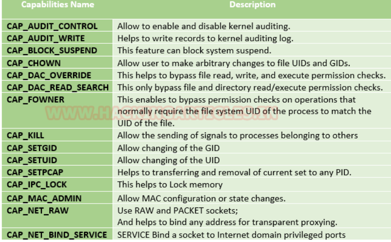

==== 5. PATH Hijacking

El PATH Hijacking se produce cuando un script que se ejecuta con privilegios elevados (como root) llama a comandos sin especificar una ruta absoluta. Si un atacante puede manipular el entorno PATH, podría colocar un ejecutable malicioso en una ruta que aparezca antes en el orden de búsqueda del PATH. De esta manera, el sistema ejecutaría el archivo malicioso en lugar del ejecutable legítimo, lo que permitiría al atacante ejecutar código malicioso con privilegios elevados.

==== Otros vectores

*NFS* permite compartir directorios y archivos entre sistemas a través de una red. Sin embargo, una configuración incorrecta puede introducir vulnerabilidades críticas que faciliten la escalada de privilegios.

La opción *no_root_squash* en la configuración de NFS permite que el usuario root en el cliente mantenga privilegios de root en el servidor al acceder a los recursos compartidos. Esto puede ser explotado por un atacante para crear archivos con permisos SUID en el servidor, facilitando la obtención de una shell con privilegios elevados. Por defecto, NFS utiliza root_squash para mapear al usuario root del cliente a un usuario anónimo sin privilegios, como nfsnobody, mitigando este riesgo.

== Solucionar la máquina

En esta guía nos centraremos en la escalada de privilegios vertical, aprendiendo cómo elevar los privilegios desde un usuario estándar en distintos contextos. En esta máquina, simularemos que ya hemos obtenido las credenciales de un usuario. Es importante mencionar que existen muchas técnicas para escalar privilegios, pero aquí veremos las más comunes.

Además, a lo largo de esta máquina veremos vulnerabilidades de binarios asi que recomiendo este repositorio: https://gtfobins.github.io/[GTFOBins]

Debemos tener en cuenta que hay tres servicios activos:

* *Apache* → Muestra archivos del servidor FTP: (http://dante.172.35.0.2.nip.io)

* *FTP* → Permite subir archivos autenticándonos como usuario: (ftpuser:ftp123)

* *SSH* → Proporciona acceso al sistema para gestión remota: (user:password)

Dado que ya disponemos de las credenciales, nos conectamos al contenedor SSH.

[source,bash]
----
$ ssh user@172.35.0.4 -p 22
----

Si nos sale un error ponemos el comando que nos indica:

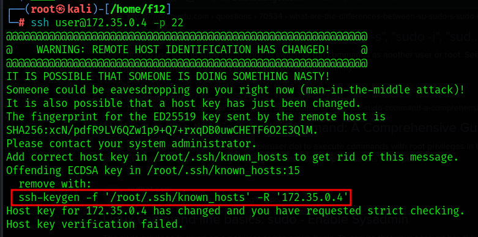

=== 1. Archivo sudoers

==== Reconocimiento

Una vez dentro como usuario, deberemos verificar si tenemos privilegios sobre algún comando específico, para ello usamos el siguiente comando:

[source,bash]
----
$ sudo -l
----

* *-l* -> Lista los comandos específicos a los que el usuario tiene privilegios.

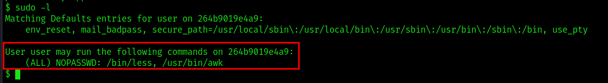

==== Escalada

Cómo podemos ver tenemos permisos en los binarios de less y awk. No necesitamos conocer cómo funciona el comando, sino cómo vulnerarlo, por lo que podemos buscarlo en GTFOBins,:

===== less

Buscnado en GTFOBins, en la sección de *Sudo* encontraremos cómo vulnerarlo -> https://gtfobins.github.io/gtfobins/less/[GTFOBins less]

Entonces, como este comando usa root, lo que necesitaremos es crear una shell dentro de él, entonces los comandos que ejecute esa shell serán de administrador y habremos escalado:

[source,bash]
----
$ sudo less /etc/profile
$ !/bin/sh
----

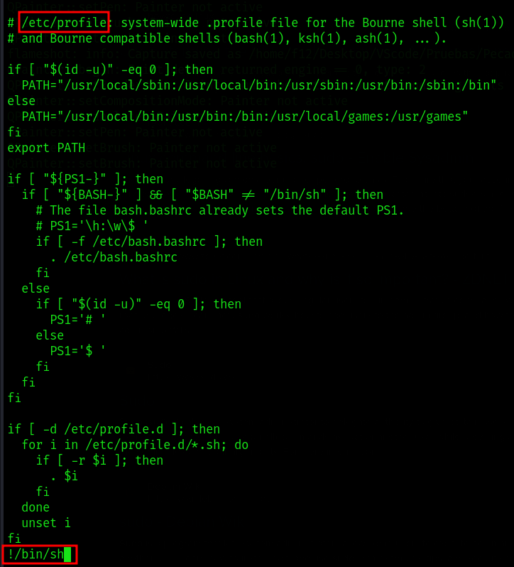

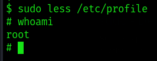

===== awk 

Hacemos el mismo proceso anterior, buscando en GTFOBins -> https://gtfobins.github.io/gtfobins/awk/[GTFOBins awk]

[source,bash]
----
$ sudo awk 'BEGIN {system("/bin/sh")}'
----

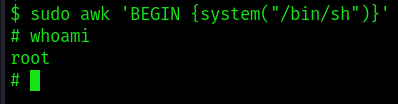

De esta forma podemos escalar de privilegios si tenemos permisos de root en algunos comandos.

=== 2. Binario SUID

==== Reconocimiento

Primeramente vamos a buscar los binarios SUID que hay en el sistema:

[source,bash]
----
$ find / -perm -4000 -type f 2>/dev/null
----

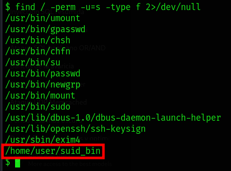

Podemos ver que hay una ruta que es distinta a todas las otras, podemos ver su código para entender mejor que ocurre si lo ejecutamos.

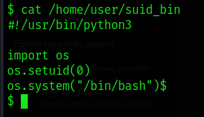

==== Escalada

Es un código escrito en python3 que inicia una shell, cómo tiene el bit SUID, abrerá dicha shell como root. Por lo que nos disponemos a ejecutarlo:

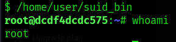

Y cómo podemos ver somos root, esto es muy útil conocerlo, ya que si un servicio con privilegios de root le diese el bit SUID a un archivo, este se ejecutaría con permisos de root, lo cual lo vamos a ver en el siguiente vector.

=== 3. Cron ejecutando script editable

==== Reconocimiento

Para este caso, deberemos comprobar primeramente qué se está ejecutando con crontab, de esta forma podemos ver si hay algún archivo vulnerable. Por lo que ejecutamos el siguiente comando para verlo:

[source,bash]
----
$ cat /etc/crontab
----

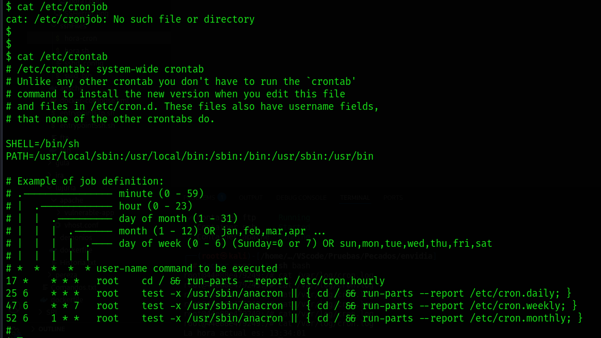

En este caso, no aparece ningún archivo que se esté ejecutando, por lo que miramos en otras rutas:

[source,bash]
----
$ ls -l /etc/cron*
----

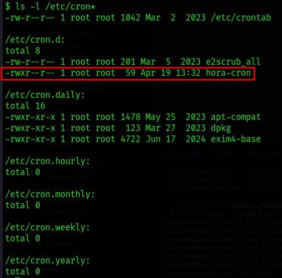

Podemos ver que hay uno que se ha ejecutado recientemente, y podemos leerlo, posiblemente tenga la ruta del script que ejecute:

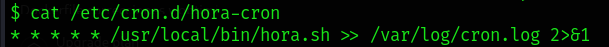

El contenido nos muestra que cada minuto ejecuta ese script y lo almacena en un log, por lo que podemos ver los logs:

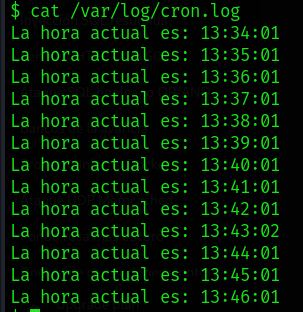

Por lo que este script da la hora cada minuto, entonces vamos a ver sus permisos y si podemos editarlo:

[source,bash]
----
$ ls -la /usr/local/bin/hora.sh
----

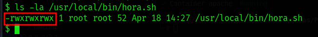

==== Escalada

Cómo tiene permisos de escritura para otros, podemos editarlo y sobrescribir en el archivo. Asi que vamos a ejecutar una shell como root creando en /tmp el archivo rootbash:

[source,bash]
----
$ echo '#!/bin/bash' > /usr/local/bin/hora.sh 
$ echo 'cp /bin/bash /tmp/rootbash' >> /usr/local/bin/hora.sh    
$ echo 'chown root:root /tmp/rootbash' >> /usr/local/bin/hora.sh    
$ echo 'chmod +s /tmp/rootbash' >> /usr/local/bin/hora.sh 
----

Este conjunto de comandos sobrescribe el script /usr/local/bin/hora.sh que será ejecutado automáticamente por cron con privilegios de root. El script copia el binario de bash a /tmp/rootbash, cambia su propietario a root y le aplica el bit SUID, lo que permite que cualquier usuario que lo ejecute obtenga una shell con privilegios de root, cómo hemos visto antes.

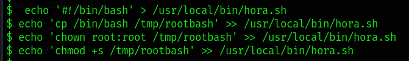

Una vez hecho esto, esperamos a que cronjob lo ejecute como root:

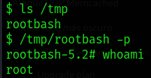

De esta forma hemos visto como encontrar ejecutables vulnerables con cronjob, aunque hay herramientas que pueden facilitarnos el trabajo como:

* https://github.com/peass-ng/PEASS-ng/[LinPEAS]
* https://github.com/DominicBreuker/pspy[pspy]

Hay muchas formas de vulnerar cronjob mediante otros vectores, por lo que recomiendo mirar -> https://juggernaut-sec.com/cron-jobs-lpe/[Escalada con Cronjob].

=== 4. Capacidades en binario

==== Reconocimiento

Deberemos conocer que paquetes tiene instalados el sistema, ya que puede tener lenguajes cómo python que nos pueden ayudar a escalar, por lo que buscamos entre todos hasta que encontremos alguno que nos interese:

[source,bash]
----
$ dpkg -l
----

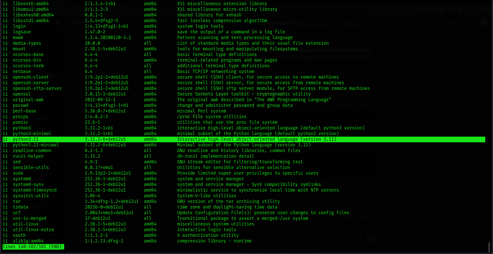

Cómo tiene python podemos hacer un sleep con este para ver el número de proceso es y ver sus capabilities:

[source,bash]
----
$ python3 -c 'import time; time.sleep(500)'
----

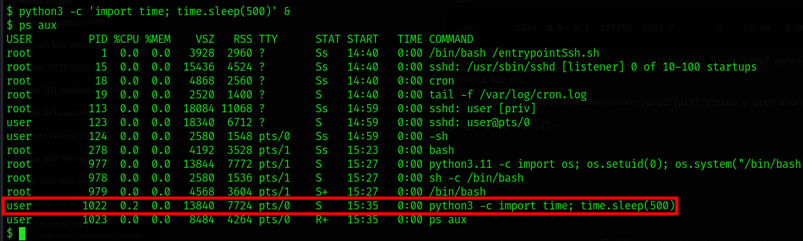

Podemos ver que su PID es el 1022, para encontrar las capabilities podemos verlo en /proc, donde habrá varios números los cuales son los IDs de los procesos:

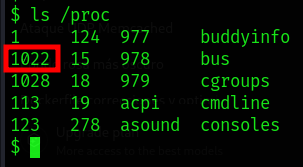

Para ver que capabilities tiene ese proceso ponemos el siguiente comando:

[source,bash]
----
$ cat /proc/(PID)/status | grep Cap
----

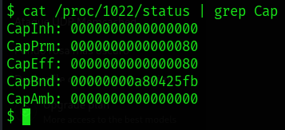

Estos nos aparecerán en hexadecimal, para entenderlo podemos usar *capsh*, el cual podemos instalar en nuestro sistema y decodificar cada hexadecimal. En este caso solo tenemos tres números, pero antes de esto debemos entender las lineas:

[source,bash]
----
CapInh -> Capabilities Inherentes (Inheritable)
CapPrm -> Capabilities Permitidas (Permitted)
CapEff -> Capabilities Efectivas (Effective)
CapBnd -> Límite de Bound capabilities
CapAmb -> Ambient capabilities
----

En cuanto a los números tenemos:

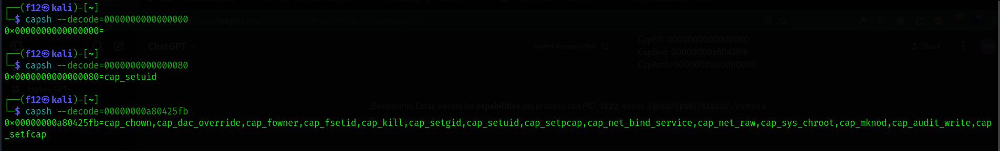

El que nos interesa es *CAP_SETUID* que aparece en *CapPrm* y *CapEff*, esto significa que permite a un proceso cambiar su UID y, por lo tanto, escalar privilegios. Normalmente, solo el usuario root puede hacer esto, pero si un proceso tiene CAP_SETUID, puede cambiar a cualquier otro usuario, incluido root.

==== Escalada

Por lo que si nos vamos a GTFOBins y en la parte de Capabilities -> https://gtfobins.github.io/gtfobins/python/#capabilities[GTFOBins python].

[source,bash]
----
python3 -c 'import os; os.setuid(0); os.system("/bin/sh")'
----

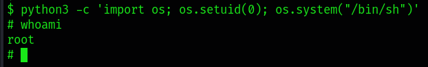

Ajustando un poco el comando a python3 podremos escalar como root.

=== 5. PATH Hijacking

==== Reconocimiento:

Primeramente podemos ver nuestro /home si hay algún script que utilice algún comando normal, como ls, head, etc. En nuestro caso tenemos uno que se llama top10.py, si lo inspeccionamos muestra los 10 primeros usuarios y tiene permisos de root ya que tiene el bit SUID:

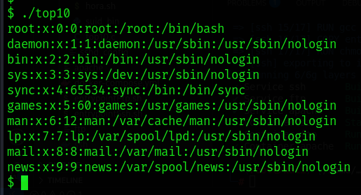

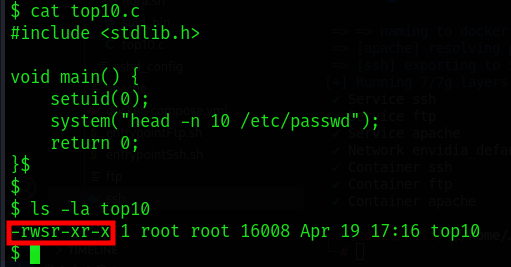

Cómo ejecuta head como root, debe de obtener su función de $PATH:

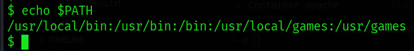

==== Escalada

Por lo que nosotros vamos a cambiar el path para que primero mire donde estamos y crearemos un script que nos de una shell como root.

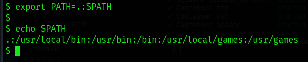

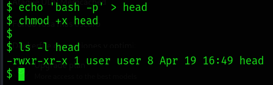

Una vez hecho ejecutamos el programa:

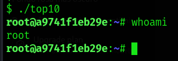

==== Aclaración

Cómo hemos visto en este último, el código del programa estaba en C, si hubiese estado en Python o Bash, no hubiese funcionado el PATH hijacking. Esto es porque el bit SUID solo funciona con binarios compilados (como los hechos en C) porque el sistema los ejecuta directamente y respeta el privilegio del propietario (por ejemplo, root). En cambio, los scripts como Bash o Python son interpretados, y el sistema lanza el intérprete (no el script) sin aplicar el SUID, por seguridad. Así se evita que scripts fácilmente modificables obtengan privilegios elevados.

== ¿Cómo prevenir?

=== 1. Archivo sudoers

* *Revisar permisos* -> Utilizar *sudo -l* para listar los comandos que un usuario puede ejecutar con sudo. De esta forma nos aseguramos de que solo se permitan los comandos necesarios.

* *Evitar NOPASSWD innecesario* -> No otorgar la opción *NOPASSWD* a menos que sea absolutamente necesario, ya que permite ejecutar comandos sin autenticación adicional.

* *Especificar rutas completas* -> En el archivo sudoers es importante definir las rutas completas de los comandos permitidos para evitar que se ejecuten versiones maliciosas ubicadas en otras rutas.

* *Uso de visudo* -> Para editar el archivo *sudoers* se utiliza visudo debido a que la sintaxis incorrecta puede dejarlo con un sistema roto donde es imposible obtener privilegios elevados.

=== 2. Binario SUID

* *Eliminar permisos SUID y SGID innecesarios:*

[source,bash]
----
$ find / -perm -4000 -o -perm -2000 -type f -exec chmod u-s,g-s {}
----

* *Revisar periódicamente archivos con permisos elevados:*

[source,bash]
----
$ find / -perm -4000 -o -perm -2000 -type f 2>/dev/null
----

* *Usar herramientas* -> Implementar herramientas de monitoreo como AuditD y SELinux.

* *Aplicar el principio de privilegio mínimo* -> Evitar que usuarios no administradores tengan acceso a binarios sensibles.

* *Habilitar autenticación multifactor y segmentación de red para minimizar impacto en caso de explotación.*

=== 3. Cronjob

* *Revisar cronjobs* -> Auditar las tareas programadas en /etc/crontab, /etc/cron.d/, y los crontabs de usuarios para identificar posibles riesgos.

* *Restringir permisos de scripts* -> Tenemos que verificar que los scripts ejecutados por cronjobs no sean modificables por usuarios sin privilegios.

* *Evitar ejecutar scripts en directorios temporales* -> No se recomiendan tareas que ejecuten scripts ubicados en directorios como /tmp o /var/tmp.

* *Especificar rutas absolutas* -> En los cronjobs, es importante utilizar rutas absolutas para los comandos y scripts ejecutados.

=== 4. Capabilities

* *Enumerar capabilities asignadas:*

[source,bash]
----
$ getcap -r / 2>/dev/null
----

* *Revocar capabilities innecesarias* -> Podemos usar *setcap -r <archivo>* para eliminar capabilities de binarios que no las requieran.

* *Evitar asignar capabilities peligrosas* -> Por ejemplo, *cap_setuid* o *cap_dac_read_search* pueden ser riesgosas si se asignan a binarios accesibles por usuarios sin privilegios.

* *Implementar políticas de seguridad* -> Se recomienda configurar mecanismos como *AppArmor* o *SELinux* para restringir el uso de capabilities.

=== 5. PATH Hijacking

* *Usar rutas absolutas* -> En scripts y binarios, se debe especificar la ruta completa de los comandos, por ejemplo, /usr/bin/head en lugar de head.

* *Validar y restringir el $PATH* -> Nos debemos asegurar de que el $PATH no incluya directorios escribibles por usuarios sin privilegios, como . o /tmp.

* *Configurar secure_path en sudoers* -> Es importante definir un $PATH seguro para comandos ejecutados con sudo.

* *Revisar scripts con privilegios* -> Podemos auditar scripts que se ejecutan con privilegios elevados para asegurarte de que no sean susceptibles a path hijacking.

=== Otros vectores

Un caso no explorado es el de NFS, aquí veremos cómo mitigarlo:

* *Evitar no_root_squash* -> Nos debemos asegurar de que la opción *no_root_squash* no esté habilitada en el archivo */etc/exports*. Esta opción permite que el usuario root en el cliente NFS tenga privilegios de root en el servidor, lo cual es peligroso.

* *Utilizar root_squash* -> Esta opción mapea las solicitudes del usuario root del cliente a un usuario sin privilegios en el servidor, como *nobody*, reduciendo el riesgo de escalada de privilegios.

* *Montar con opciones seguras* -> En el cliente, debemos montar los sistemas de archivos NFS con las opciones *nosuid* y *nodev* para evitar la ejecución de binarios con el bit SUID y el uso de dispositivos especiales.

* *Restringir el acceso* -> Limitar el acceso a las exportaciones NFS especificando direcciones IP o rangos de red específicos en el archivo /etc/exports, evitando el uso de comodines como *.

* *Auditoría regular* -> Debemos revisar periódicamente las configuraciones de NFS y los permisos de los archivos compartidos para detectar posibles vulnerabilidades.

----
"Hackear un sistema requiere conocer sus reglas mejor que las personas que lo crearon o lo están ejecutando, y explotar toda la distancia vulnerable entre cómo esas personas habían pretendido que funcionara el sistema y cómo realmente funciona, o podría funcionar. Al capitalizar estos usos no intencionales, los hackers no están rompiendo las reglas tanto como desacreditarlas."

- Edward Snowden
----